# Portfolio Website

Using vite.js, I designed a website where the user can see all of my coding projects done so far as well as know more about me and my email contact if they so wish to email me. The user can view the website in light or dark mode and will save this setting so the user doesn't have to keep changing the mode. My resume is viewable by clicking the resume button at the top right of the screen. Depending on the device the user is using to view this website, the navigation menu at the top right of the website becomes a hamburger menu that users can click on to view the options the navigation menu has. 

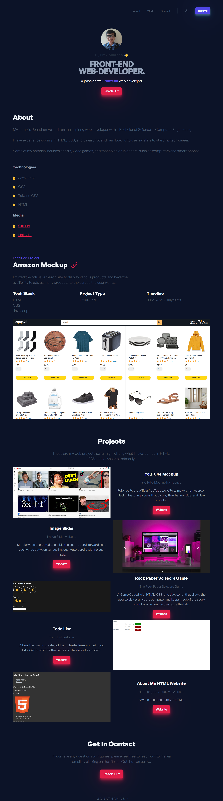

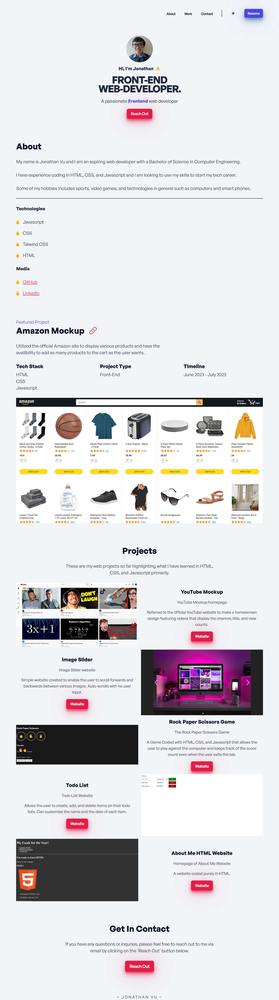

This website exists to showcase the projects I have done so far and work on my frontend skills to hopefully land a job as a frontend web developer. 

The technical concepts this project supports are getting the hamburger menu to appear if the user is using a mobile device, switching the colors to reflect whether light or dark mode is on, getting the grid for the projects to have a zig-zag pattern, and using media queries to modify the website's appearance so that the website can still look good and function on any device,.

# Core Technical Concepts

In the styles.css file, many color and size variables are set. This is because we want to use these variables throughout the project across different files, so referring to the variables' names instead of typing each color and size out every time saves time.

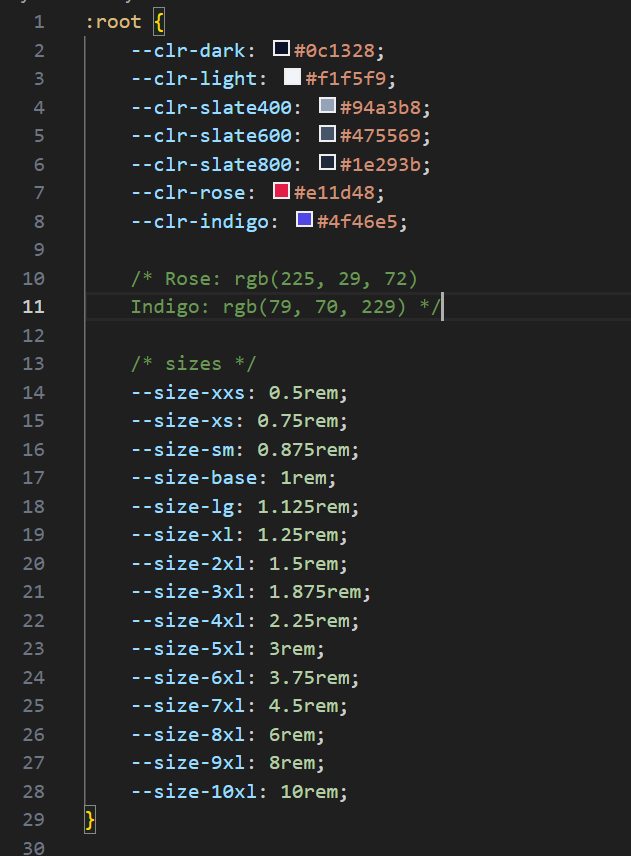

Using Vite.js, the JavaScript is where we import our CSS files, not in our HTML. Being shown here is the main.js file. The mobileNav, darkMode, and lazyLoading represent functions being called from their respective JavaScript files. 

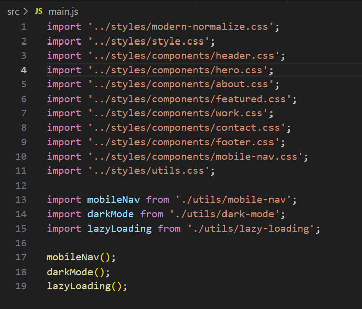

The variable mobileNav is set equal to an arrow function where it selects the header bars, mobile nav, and the mobile nav link on the document body. The code listens for a click on the headerBtn variable and assigns isMobileNavOpen to its inverse state which is true. The event listener tests if the isMobileNavOpen variable is a truthy statement. If it is, set the mobile nav to have a display of flex with document.body.style.overflowY = 'hidden'. This makes it so that the mobile nav is visible. If isMobileNavOpen is a falsy statement, the display gets set to none and document.body.style.overflowY = 'auto'. This makes it so the mobile nav is hidden. 

For each mobile nav link, we listen for a 'click' event. I wanted opening one of the links to close the nav menu. Since the nav menu must be open to view these links, I set the isMobileNavOpen variable to false, set the mobile nav to have a style of none, and document.body.style.overflowY = 'auto' to restore the scrollbar after clicking on any of the links.

The variable mobileNav is then exported to the main.js file.

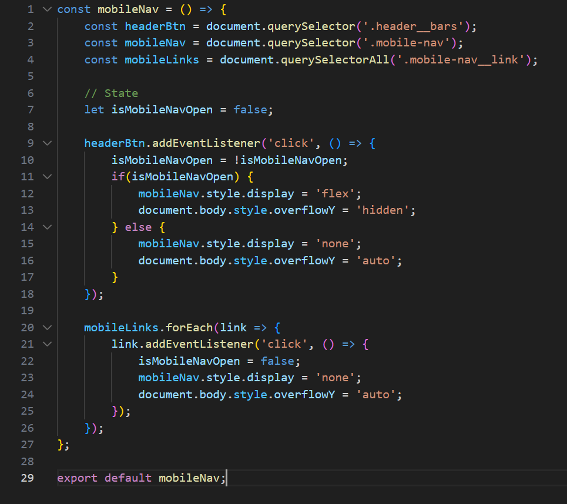

Notice that the light and dark colors are switched in light mode. 

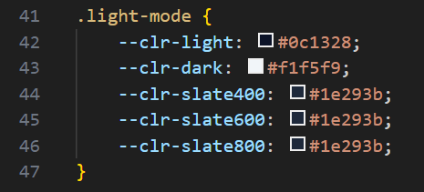

The variable darkMode is set equal to an arrow function where the variable themeToggleBtns is equal to all buttons with the ID 'theme-toggle'. Only the sun buttons for the header and the mobile nav have this ID. 

The variable theme is set to get 'theme' from the local storage. This returns 'light-mode' depending on if the key value pair 'theme' exists in the local storage or not. This line of code runs the moment the page is loaded. The next line of code tests if the theme is a truthy statement. If it is, the class theme gets added to the document body. These lines of code helps store the setting the user chose last for light versus dark mode so that the user can go back to the website with the setting chosen last. 

The code listens for a 'click' event for both buttons and if one is 'clicked', the variable handleThemeToggle gets called. This variable is set equal to an arrow function which toggles the 'light-mode' class onto the document body. If the body has this class, set the set the theme to light mode and set the key value pair 'theme' and 'light-mode' to the local storage. If it doesn't, remove the key value pair 'theme' from the local storage and the class from the body. 

The variable darkMode is then exported to the main.js file.

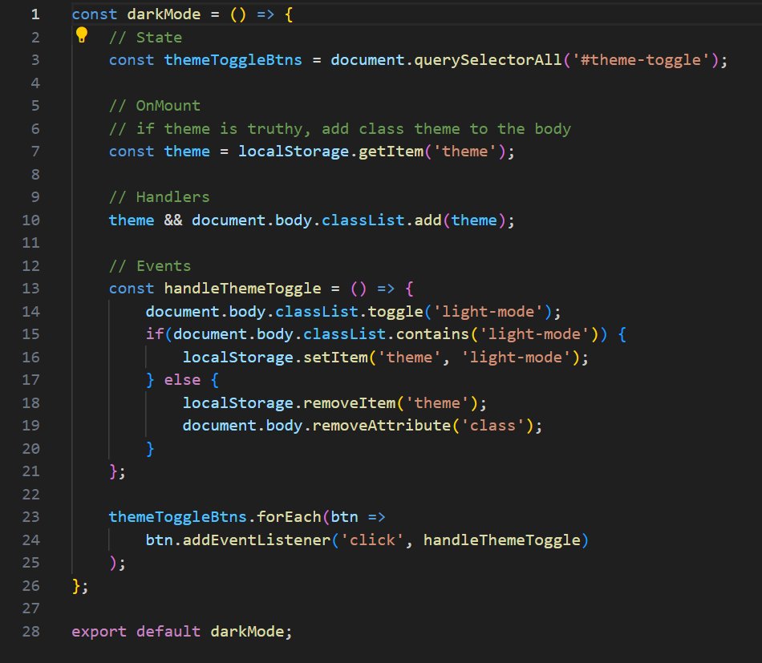

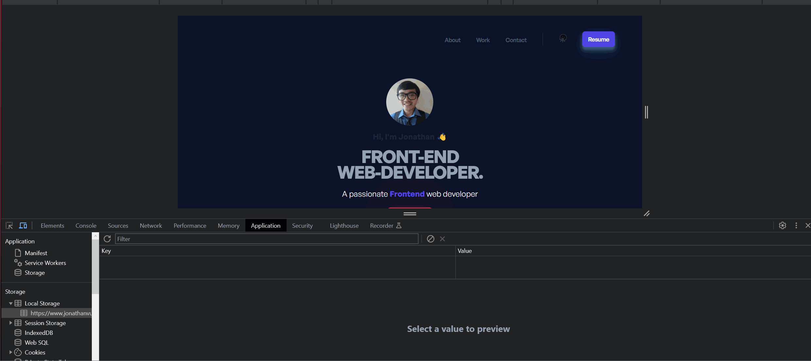

For the projects, if the width of the device being used to view the website is at minimum 640 pixels, the display is changed to grid with two columns each taking up 1 free space. The template areas are set to as one image, one content (where it has the two descriptions and the name for the select project), one content and one image for the next row, and so on. The image and the information for the project have the respective image and content classes respectively. The grid areas are then set to that specific image and content. 

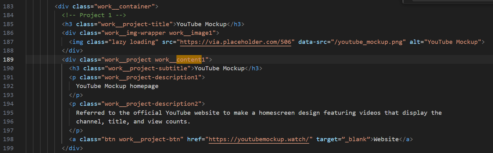

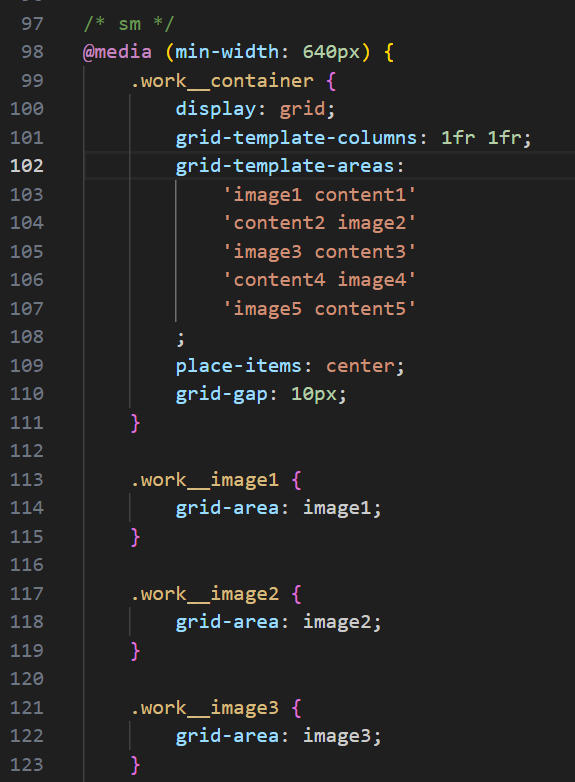

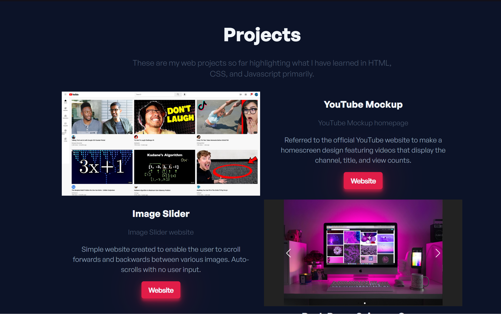

Most of the CSS files used for this project have media queries that help adjust the appearance of the website to still look good no matter what device the user is using. The media queries are set mobile first and the set breakpoints used were 475 pixels, 640 pixels, 768 pixels, 1024 pixels, 1280 pixels, and 1536 pixels in width. 

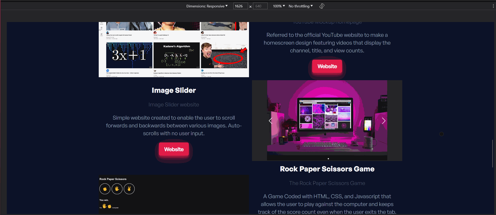

## Getting Started/Requirements

To run this website, download the code from [github.com/JCV2022/About-Me-Website](https://github.com/JCV2022/About-Me-Website)

A code editor program is needed. Any should do fine, I used Visual Studio Code to code my website.

If node.js isn't installed on your machine, download the LTS version through this link [nodejs.org/en](https://nodejs.org/en) and run the installation.exe file.

Git was used for this project. Go to [git-scm.com/downloads](https://git-scm.com/downloads) and download git for your respective device. After downloading the file and running the installation exe found in your downloads folder, open Visual Studio Code and click on source control on the left hand bar with the project still open and click on 'initialize repository'. This allows you to keep track of changes you make to the code and also lets you push code to the GitHub repository without having to updating the repository manually. 

To do this, open the terminal in Visual Studio Code. First type

git add -A

Then

git commit -m "comment"

with comment being any text (preferably what was changed in the code). Lastly, type

git push

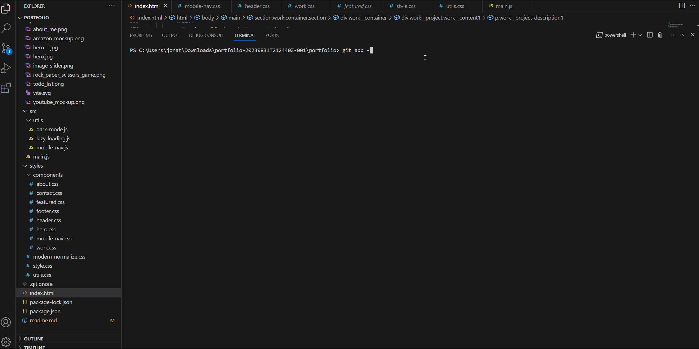

Windows Terminal is needed to download Vite.js. This terminal was downloaded from the Microsoft Store. 

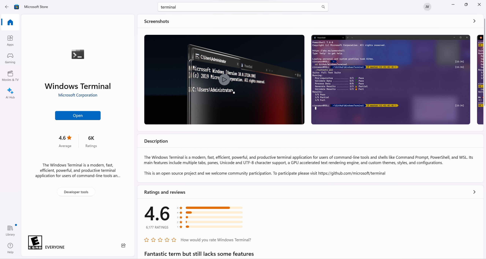

Open the terminal and click on the dropdown arrow to select settings.

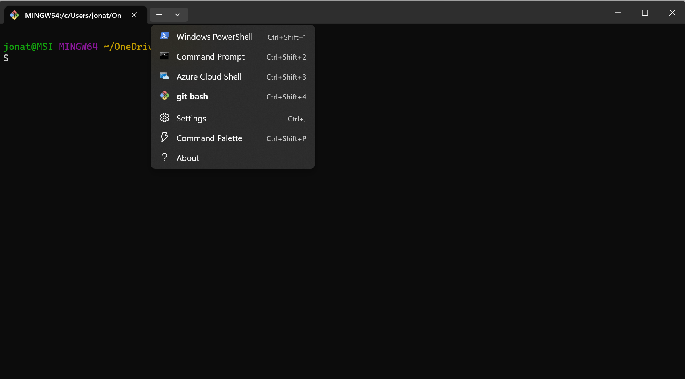

Scroll down and click on 'Add new profile' and then click on 'New empty profile'

![]images/terminal1.png)

Change the name to 'git bash'. Change the command line path to \Git\bin\bash.exe. Change the icon to the directory \Git\mingw64\share\git\git-for-windows.ico. Click save. 

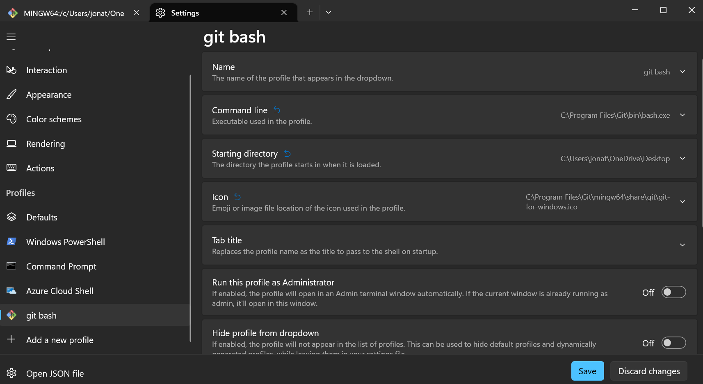

Go to 'startup' and go to the drop down menu in the 'default profile section'. Click on the profile you just created and click 'save'. Close everything. 

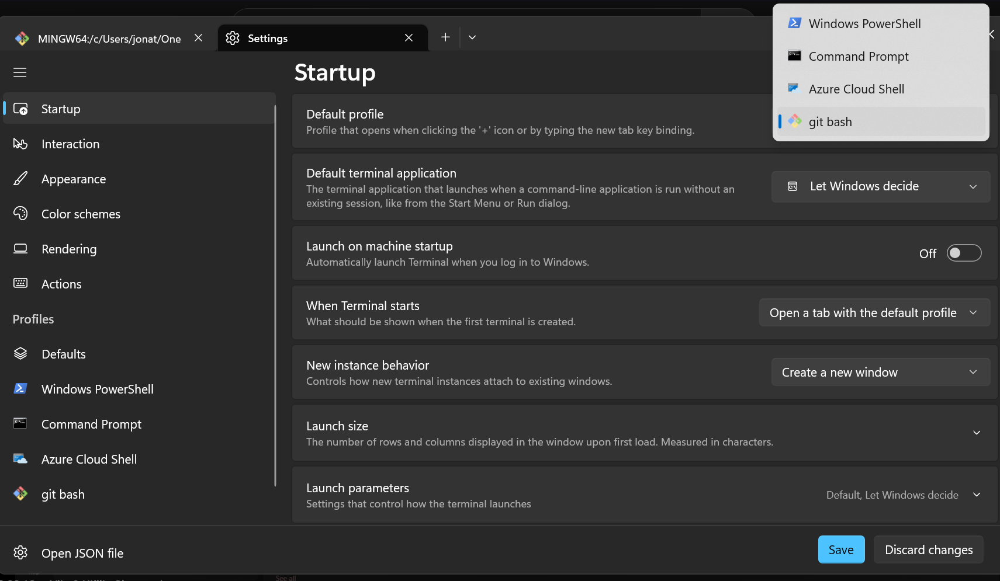

Your terminal should look something like this.

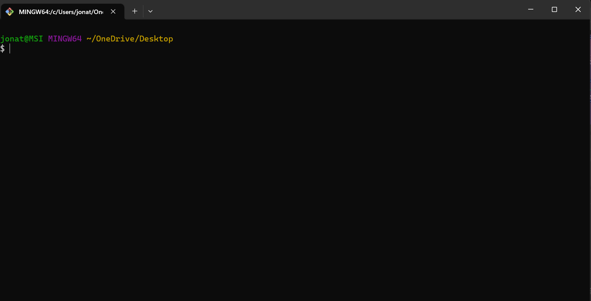

Vite.js is a powerful tool that can automatically set up our development environment (index.html, styles.css, and main.js) and comes with powerful features that aren't attainable through setting up these files manually. 

To download this, go to [vitejs.dev](https://vitejs.dev). Click on 'Get Started' on the homepage and scroll down to 'With NPM:'. Copy the command below and open the windows terminal and paste it. 

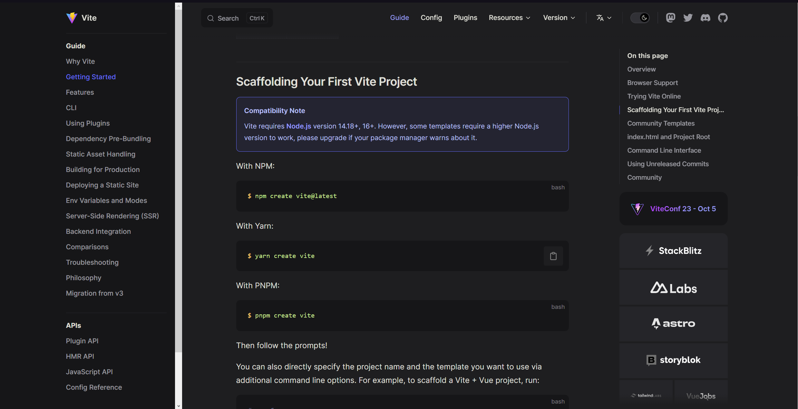

Type in the name for the project. For the framework and variant, select Vanilla and JavaScript respectively.

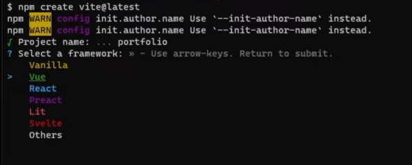

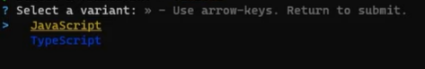

After this, type in 

cd 'project name'

then

npm i

to install the packages.

Type in 

code .

to open Visual Studio Code from the terminal. 

Delete everything in the styles.css file and everything in the main.js file except for the first line. Delete the counter.js file and the javascript.svg file. 

If you ever want to see the website live, you can go to the terminal and type either 
npm run dev 
or
npm run preview
and control click on the link it provides to see the website. Any changes to the code you make will reflect on the website after you save the code. 

Go to [github.com/sindresorhus/modern-normalize](https://github.com/sindresorhus/modern-normalize) and go to the modern-normalize.css file. Open it and download this file. Put this file inside your project. This helps create consistency in styles across all of the modern browsers. 

## Contact Info

My email address is vujonathan00@gmail.com

My github is github.com/JCV2022

My linkedIn is linkedin.com/in/jonathan-vu-409a71132/
